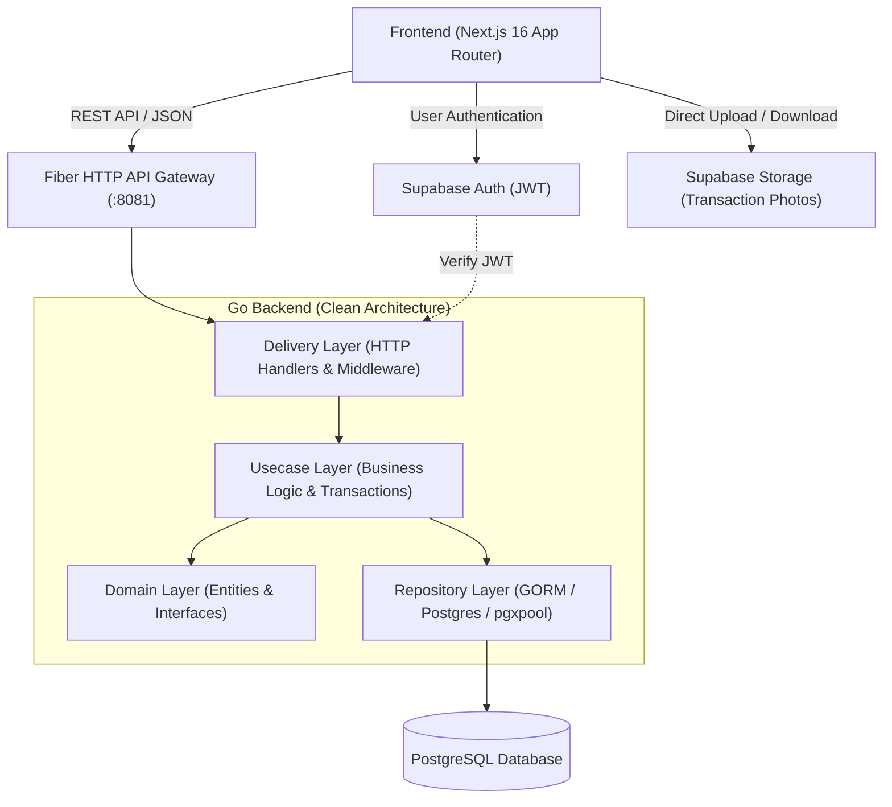

# EquipFlow - Enterprise IT Asset Borrow & Return System
> ระบบบริหารจัดการและยืม-คืนอุปกรณ์ IT ระดับองค์กร แบบ Full-Lifecycle

[](https://golang.org)
[](https://nextjs.org)
[](https://www.postgresql.org)
[](https://supabase.com)
[]()
[]()

---

## 📌 สารบัญ (Table of Contents)
1. [ภาพรวมของระบบ (Overview)](#-ภาพรวมของระบบ-overview)
2. [สถาปัตยกรรมระบบ (Architecture)](#-สถาปัตยกรรมระบบ-architecture)
3. [เทคโนโลยีที่ใช้ (Tech Stack)](#-เทคโนโลยีที่ใช้-tech-stack)
4. [ฟังก์ชันหลักของระบบ (Core Features)](#-ฟังก์ชันหลักของระบบ-core-features)
5. [ตารางโครงสร้างฐานข้อมูล (Database Schema)](#-ตารางโครงสร้างฐานข้อมูล-database-schema)
6. [การกำหนดสิทธิ์ผู้ใช้งาน (RBAC Matrix)](#-การกำหนดสิทธิ์ผู้ใช้งาน-rbac-matrix)
7. [ขั้นตอนการติดตั้งและเริ่มใช้งาน (Getting Started)](#-ขั้นตอนการติดตั้งและเริ่มใช้งาน-getting-started)
8. [คู่มือการทดสอบระบบ (Demo Accounts)](#-คู่มือการทดสอบระบบ-demo-accounts)
9. [โครงสร้างไดเรกทอรี (Directory Structure)](#-โครงสร้างไดเรกทอรี-directory-structure)

---

## 🌟 ภาพรวมของระบบ (Overview)

**EquipFlow** ถูกออกแบบและพัฒนาขึ้นเพื่อแก้ปัญหาการจัดการทรัพย์สินไอที (Enterprise IT Asset Management) ในระดับองค์กร ครอบคลุมตั้งแต่:
- การลงทะเบียนทรัพย์สินพร้อมออกป้ายสติกเกอร์ QR Code Label
- การตรวจสอบสถานะแบบ Real-time และการป้องกันการจองซ้ำซ้อน (Double-Booking Prevention)
- ระบบส่งมอบและตรวจรับคืนอุปกรณ์พร้อมถ่ายรูปบันทึกสภาพทรัพย์สินลง Cloud Storage
- ระบบประเมินความเสียหายและคิดค่าปรับ (Damage Assessment & Fine Calculator)
- การตรวจสอบสิทธิ์แบบลำดับขั้น (Role-Based Access Control - RBAC)
- บันทึกประวัติกิจกรรมทุกขั้นตอนแบบไม่สามารถแก้ไขได้ (Immutable Audit Trail)

---

## 🏗️ สถาปัตยกรรมระบบ (Architecture)

ระบบถูกออกแบบด้วยหลักการ **Clean Architecture** และ **Separation of Concerns**:



---

## 💻 เทคโนโลยีที่ใช้ (Tech Stack)

### Backend (Go / Golang)
- **Language:** Go 1.22+
- **Web Framework:** [GoFiber v2](https://gofiber.io/) (High-performance Express-inspired framework)
- **ORM / Driver:** [GORM](https://gorm.io/) with `pgx` driver connection pool
- **Architecture:** Clean Architecture (Domain -> Usecase -> Repository -> Delivery)
- **Security:** Supabase JWT Verification, Role-based RBAC Middleware, CORS Handling

### Frontend (Next.js)
- **Framework:** Next.js 16 (App Router) + React 19 + TypeScript
- **Styling:** TailwindCSS v4 (Custom Clean White & Emerald Green palette)
- **State & Data Fetching:** TanStack React Query v5 (Optimistic updates & Cache invalidation)
- **Icons:** Lucide React Icons
- **QR Code Engine:** `qrcode.react` (High-density QR code labels)

### Database & Cloud Services (Supabase)
- **Database:** PostgreSQL 15+ hosted on Supabase
- **Authentication:** Supabase Auth (Email & Password with JWT and triggers)
- **Object Storage:** Supabase Storage (`transactions` bucket for inspection photos)

---

## 🚀 ฟังก์ชันหลักของระบบ (Core Features)

### 1. การเข้าสู่ระบบและการจัดการสิทธิ์ (Authentication & RBAC)
- **Dedicated Login & Register Pages:** หน้า `/login` และ `/register` สวยงาม ทันสมัย
- **Role-Based Redirection:** เมื่อเข้าสู่ระบบ ระบบจะตรวจ Permission และนำทางไปยังหน้าจอที่ตรงกับสิทธิ์ทันที
- **Super Admin Grant Permissions:** Super Admin สามารถเลื่อนขั้น ปรับลดสิทธิ์ หรือระงับบัญชี (Suspend/Activate) ได้แบบ Real-time
- **Database Trigger:** เมื่อสมัครสมาชิกใหม่ PostgreSQL Trigger จะสร้าง Profile ในตาราง `public.profiles` อัตโนมัติ

### 2. คลังทะเบียนทรัพย์สินไอที (Asset Catalog & QR Generator)
- รองรับการจัดการอุปกรณ์มากกว่า **2,000+ รายการ**
- ค้นหาด้วย Asset Tag, ชื่อรุ่น, หรือยี่ห้อแบบ Instant Search
- **Printable QR Code Modal:** สร้างป้ายสติกเกอร์รหัสทรัพย์สินพร้อมพิมพ์ติดตัวเครื่อง (รูปแบบ `EQUIPFLOW:ASSET:<UUID>`)
- ลงทะเบียนอุปกรณ์ใหม่พร้อมระบุ Serial Number, สภาพเครื่อง, และสถานที่จัดเก็บ

### 3. ระบบยืม-คืนและการป้องกันการจองซ้อน (Double-Booking Prevention)
- ตรวจสอบช่วงเวลาการยืม (Start Date - End Date) เพื่อป้องกันไม่ให้อุปกรณ์ชิ้นเดียวกันถูกจองซ้อนทับกัน
- Flow สถานะคำขอ: `PENDING` ➔ `APPROVED` ➔ `BORROWED` ➔ `RETURNED` (หรือ `REJECTED`)
- เจ้าหน้าที่ IT Admin สามารถตรวจสอบและกดอนุมัติ/ปฏิเสธคำขอได้ทันที

### 4. การตรวจสภาพ ส่งมอบ และรับคืนอุปกรณ์ (Inspection & Return Center)
- **Inspection Handover:** ถ่ายรูปและอัปโหลดหลักฐานสภาพเครื่องก่อนส่งมอบขึ้น Cloud Storage
- **Inspection Return & Damage Assessment:** บันทึกสภาพอุปกรณ์ขณะรับคืน พร้อมระบบคำนวณค่าปรับความเสียหายกรณีเครื่องชำรุด
- บันทึกหมายเหตุอุปกรณ์เสริม (Adapter, สายชาร์จ, กระเป๋า)

### 5. แดชบอร์ดสรุปสถิติผู้บริหาร (Executive Overview & Audit Trail)
- **KPI Metrics:** จำนวนอุปกรณ์ทั้งหมด, พร้อมให้ยืม, กำลังถูกยืม, และอัตราการหมุนเวียน (Utilization Rate %)
- **Category Inventory:** สรุปสถิติอุปกรณ์แยกตามหมวดหมู่ (Laptops, Workstations, Displays, ฯลฯ)
- **Enterprise Audit Trail:** บันทึกประวัติกิจกรรมสำคัญ (User ID, IP, Action, Old Data, New Data) แบบ Immutable ไม่สามารถแก้ไขหรือลบได้

---

## 🗄️ ตารางโครงสร้างฐานข้อมูล (Database Schema)

```
public.profiles            - ข้อมูลผู้ใช้งานและสิทธิ์ (EMPLOYEE, IT_ADMIN, SUPER_ADMIN)
public.categories          - หมวดหมู่อุปกรณ์ (Laptops, Desktops, Monitors, ฯลฯ)
public.locations           - อาคารและห้องจัดเก็บอุปกรณ์
public.assets              - ทะเบียนทรัพย์สินไอที (Serial, Specs JSONB, สถานะ, สภาพ)
public.borrow_requests     - รายการคำขอยืมอุปกรณ์และช่วงเวลาการใช้งาน
public.asset_transactions  - บันทึกการส่งมอบและตรวจรับคืน พร้อม URL รูปภาพและค่าปรับ
public.audit_logs          - บันทึกประวัติการเปลี่ยนแปลงระบบ (Audit Trail)
```

---

## 🛡️ การกำหนดสิทธิ์ผู้ใช้งาน (RBAC Matrix)

| ความสามารถ / ฟังก์ชัน | EMPLOYEE | IT_ADMIN | SUPER_ADMIN |
| :--- | :---: | :---: | :---: |
| ค้นหาและดูแคตตาล็อกอุปกรณ์ | ✅ | ✅ | ✅ |
| ส่งคำขอยืมอุปกรณ์ของตนเอง | ✅ | ✅ | ✅ |
| ดูประวัติการยืมของตนเอง | ✅ | ✅ | ✅ |
| พิมพ์ป้ายสติกเกอร์ QR Code | ❌ | ✅ | ✅ |
| เพิ่ม / แก้ไขทะเบียนทรัพย์สิน | ❌ | ✅ | ✅ |
| อนุมัติ / ปฏิเสธคำขอยืม | ❌ | ✅ | ✅ |
| บันทึกส่งมอบ & ตรวจรับคืน (Inspection) | ❌ | ✅ | ✅ |
| ดูประวัติกิจกรรมทั้งระบบ (Audit Trail) | ❌ | ✅ | ✅ |
| กำหนดสิทธิ์ / ปรับ Role ผู้ใช้งาน (Grant Role) | ❌ | ❌ | ✅ |
| ระงับ / ปลดระงับการใช้งานบัญชี (Toggle Status) | ❌ | ❌ | ✅ |
| ลบรายการทรัพย์สินออกจากระบบ | ❌ | ❌ | ✅ |

---

## 🚀 ขั้นตอนการติดตั้งและเริ่มใช้งาน (Getting Started)

### 1. การเตรียมความพร้อม (Prerequisites)
- [Node.js](https://nodejs.org) (v18 หรือสูงกว่า)
- [Go (Golang)](https://go.dev) (v1.22 หรือสูงกว่า)
- บัญชี [Supabase](https://supabase.com) พร้อมโปรเจกต์ PostgreSQL

### 2. ตั้งค่า Backend (Go API)
```bash
# นำทางไปยังโฟลเดอร์ backend
cd backend

# ติดตั้ง Go Dependencies
go mod download

# ตรวจสอบไฟล์การตั้งค่า .env (หรือคัดลอกจาก .env.example)
# DB_HOST, DB_PORT, DB_USER, DB_PASSWORD, DB_NAME, SUPABASE_JWT_SECRET

# รัน Backend Server
go run cmd/api/main.go
# หรือรันไฟล์ Binary: .\bin\api.exe
```
Backend API จะทำงานที่: `http://localhost:8081`

### 3. ตั้งค่า Frontend (Next.js)
```bash
# นำทางไปยังโฟลเดอร์ frontend
cd frontend

# ติดตั้ง NPM Dependencies
npm install

# รัน Next.js Development Server
npm run dev
```
Frontend จะทำงานที่: `http://localhost:3000`

---

## 🔑 คู่มือการทดสอบระบบ (Demo Accounts)

ระบบมาพร้อมกับบัญชีทดสอบระดับองค์กร สามารถใช้เข้าสู่ระบบได้ทันที:

| บทบาท (Role) | อีเมล (Email) | รหัสผ่าน (Password) | สิทธิ์ที่เข้าถึงได้ |
| :--- | :--- | :--- | :--- |
| **Super Administrator** | `admin@equipflow.local` | `Diwooo1661@` | สิทธิ์สูงสุด, ศูนย์จัดการผู้ใช้, มอบสิทธิ์, ลบอุปกรณ์ |
| **IT Administrator** | `admin@equipflow.local` | `Diwooo1661@` | อนุมัติยืม, ส่งมอบ/รับคืน, สแกน QR, เพิ่มอุปกรณ์ |
| **Employee (พนักงาน)** | `employee@equipflow.local` | `Diwooo1661@` | ขอยืมอุปกรณ์, ตรวจสอบสถานะการยืม |

*(สามารถทดสอบได้ง่ายๆ ด้วยการคลิกปุ่ม **Quick Demo Accounts** ที่หน้า `/login`)*

---

## 📂 โครงสร้างไดเรกทอรี (Directory Structure)

```
EquipFlow/
├── backend/                       # Go Backend (Clean Architecture)
│   ├── cmd/api/main.go            # Entry Point ของ Backend Server
│   ├── internal/
│   │   ├── config/                # Environment configuration loader
│   │   ├── domain/                # Enterprise Business Entities & Interfaces
│   │   │   ├── asset.go
│   │   │   ├── borrow_request.go
│   │   │   ├── user.go
│   │   │   ├── analytics.go
│   │   │   └── audit_log.go
│   │   ├── repository/postgres/   # Database queries (GORM / PostgreSQL)
│   │   ├── usecase/               # Business logic & Workflow orchestration
│   │   └── delivery/http/         # Fiber HTTP Handlers, Routers & Middlewares
│   ├── bin/api.exe                # Pre-compiled executable binary
│   └── go.mod
│
├── frontend/                      # Next.js 16 App Router (TypeScript)
│   ├── src/
│   │   ├── app/                   # App Router Pages
│   │   │   ├── layout.tsx         # Root Layout
│   │   │   ├── page.tsx           # Main Dashboard & Management Hub
│   │   │   ├── login/page.tsx     # Dedicated Login Page with Role Redirect
│   │   │   └── register/page.tsx  # Dedicated Register Page
│   │   ├── components/            # UI Components & Interactive Modals
│   │   │   ├── auth-modal.tsx
│   │   │   ├── qr-code-modal.tsx
│   │   │   ├── inspection-modal.tsx
│   │   │   └── providers.tsx
│   │   ├── context/               # Global Auth & Role State Context
│   │   ├── lib/                   # Axios API Client & Supabase SDK Client
│   │   └── types/                 # TypeScript Data Contracts
│   └── package.json
│
└── README.md                      # Documentation หลักของโครงการ
```

---

## 📄 License & Authors
- **Project:** EquipFlow Enterprise IT Asset Borrow & Return Platform
- **Architect & Fullstack Engineer:** Audomsub
- **License:** MIT License
